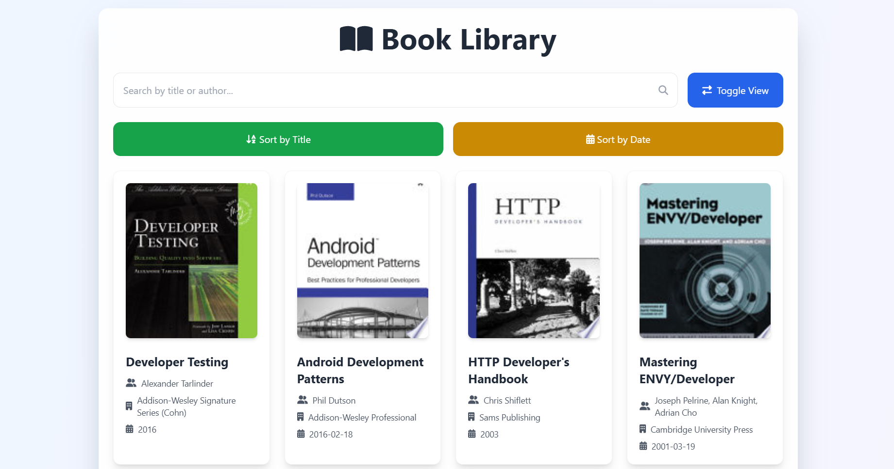

# 📚 Book Library



Welcome to the Book Library project! This project is a web application that allows users to browse, search, and view details of books fetched from an external API. The application is built using HTML, CSS (Tailwind CSS), and JavaScript.

## Features

- **Fetch Books**: Load books from an external API with pagination.
- **Search**: Search for books by title or author.
- **Sort**: Sort books by title or publication date.
- **Toggle View**: Switch between grid and list views.
- **View Details**: Open a detailed view of a book in a new tab.
- **Responsive Design**: Optimized for both desktop and mobile devices.

## Getting Started

### Prerequisites

- A modern web browser (Chrome, Firefox, Edge, etc.)
- Internet connection to fetch data from the API

### Installation

1. Clone the repository:

   ```sh
   git clone https://github.com/your-username/book-library.git
   cd book-library
   ```

2. Open `index.html` in your web browser:
   ```sh
   start index.html
   ```

## Usage

### Fetching Books

Books are fetched from the API when the page loads and when the "Load More" button is clicked. The books are displayed in a grid view by default.

### Searching Books

Use the search input to filter books by title or author. The search results are displayed in real-time as you type.

### Sorting Books

- **Sort by Title**: Click the "Sort by Title" button to sort books alphabetically by title.
- **Sort by Date**: Click the "Sort by Date" button to sort books by publication date.

### Toggling View

Click the "Toggle View" button to switch between grid and list views.

### Viewing Book Details

Click on a book card to open a detailed view of the book in a new tab. The detailed view includes the book's title, authors, publisher, publication date, and description.

## Code Overview

### `index.html`

The main HTML file that includes the structure of the web page and links to the necessary CSS and JavaScript files.

### `script.js`

The main JavaScript file that contains the logic for fetching, displaying, searching, sorting, and viewing books.

#### Functions

- **fetchBooks(page)**: Fetches books from the API for the specified page.
- **renderBooks()**: Renders the fetched books to the UI.
- **sortTitle()**: Sorts the books by title.
- **shortDate()**: Sorts the books by publication date.
- **openBookDetails(book)**: Opens a detailed view of the book in a new tab.
- **toggleView()**: Toggles between grid and list views.
- **renderListView()**: Renders the books in a list view.
- **renderGridView()**: Renders the books in a grid view.
- **searchInput()**: Filters the books based on the search input.
- **renderFilteredBooks(filteredBooks)**: Renders the filtered books to the UI.

### `styles.css`

Custom CSS styles for the project (if any).

## Dependencies

- [Tailwind CSS](https://tailwindcss.com/): A utility-first CSS framework.
- [Axios](https://axios-http.com/): A promise-based HTTP client for the browser and Node.js.

## Contributing

Contributions are welcome! Please fork the repository and submit a pull request for any improvements or bug fixes.

## License

This project is licensed under the MIT License. See the [LICENSE](LICENSE) file for details.

## Acknowledgements

- [Free API](https://api.freeapi.app/): The API used to fetch book data.
- [Tailwind CSS](https://tailwindcss.com/): For the beautiful UI components.
- [Font Awesome](https://fontawesome.com/): For the icons used in the project.

---

Happy coding! 😊
